  

|  |  |  |
|---|---|---|
| [**`iirds`**](https://github.com/dev365code/iirds-validate) | Judges **iiRDS 1.3** documentation packages — validator + reader, one install |  `▰▰▰▱▱▱▱▱▱▱` `77 / 280 obligations · a floor` |
| [**`vdi2770-validate`**](https://github.com/dev365code/vdi2770-validate) | Judges **VDI 2770** documentation containers for machine delivery |  `obligation index: in the making` |
| [**`aas-submodel-validate`**](https://github.com/attesta-standards/aas-submodel-validate) | Judges **AAS submodels** against IDTA templates |  `template packs: 3 shipped` |
| [**`standards-watch`**](https://github.com/dev365code/standards-watch) | Watches **the standards themselves** — releases, errata, template changes | [RSS](https://raw.githubusercontent.com/dev365code/standards-watch/main/feed.xml) · `daily, on the record` |

First verdict in ten seconds — <code>pip install iirds</code>

Every verdict traces to a written rule and a spec section — no model in the judgement loop · findings are judgements about files, never about people · Seoul, KR · zero8004paz@gmail.com
